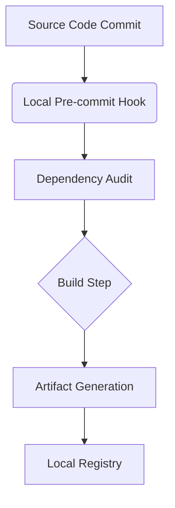

# DevForge: Local Deployment CI/CD

**TechForge Industrial**
_Automated Build and Push System_

## Overview
DevForge acts as a localized CI/CD pipeline for the TechForge ecosystem. By simulating complex production build pipelines locally, it manages version bumps, dependency auditing, and artifact generation without external cloud dependencies.

## Architecture

## Hardware Agnostic Logic
DevForge containerizes build steps using local Docker setups when available, or gracefully falls back to local shell execution, ensuring builds succeed regardless of the host environment's specific OS version.
